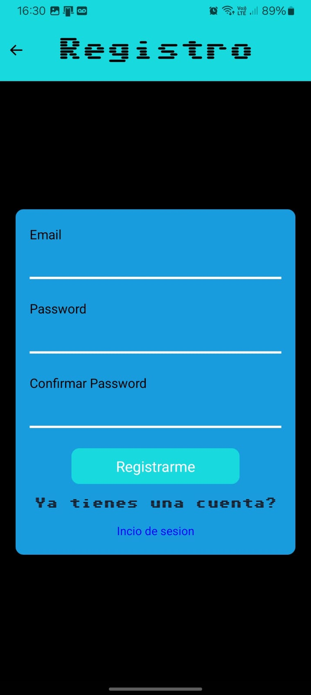
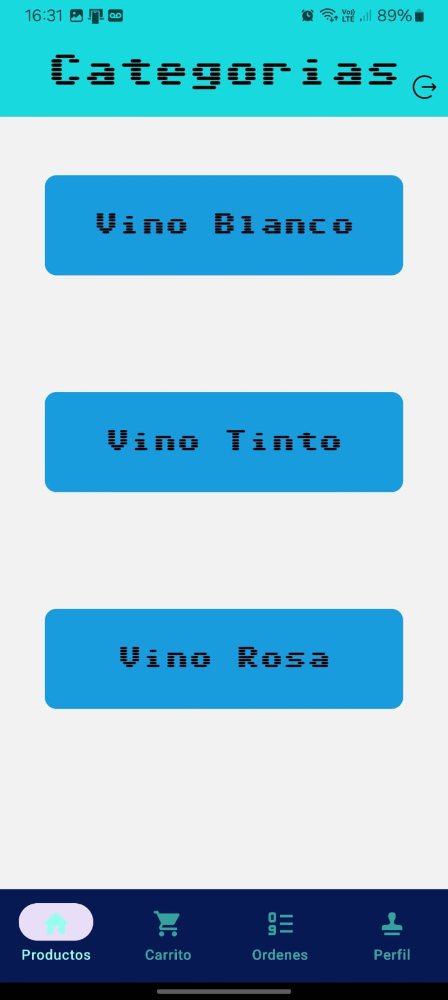
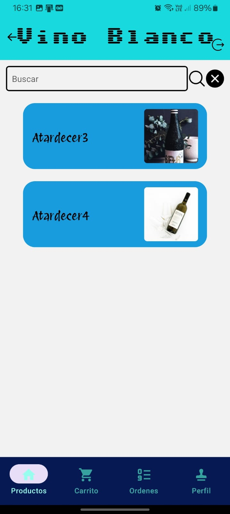
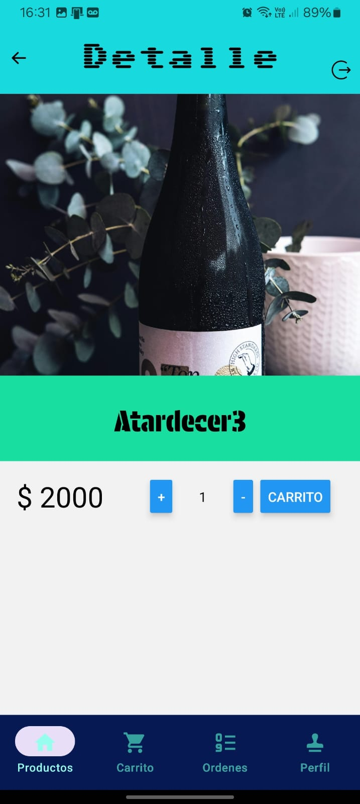

#Ecommers basado utilizando react-native
-------------

Una aplicación de una vinoteca desarrollada con React Native que ofrece una experiencia de compra completa y fácil de usar.

##Funcionalidades


+ Pantalla de Cuenta
    * Acceso seguro: Solo los usuarios autenticados pueden acceder a la pantalla de perfil y realizar compras.
    * Información del usuario: Muestra detalles del usuario, como nombre y dirección.
    * 
+ Autenticación con Firebase
	* Utiliza el sistema de autenticación de Firebase para gestionar el acceso de usuarios.
	* Permite a los usuarios iniciar sesión y registrarse de manera segura.
    * 
+ Pantalla de Categorías
	* Muestra una selección de categorías en tarjetas.
	* Al hacer clic en una categoría, se navega a la pantalla de productos correspondiente.
    * 
+ Pantalla de Productos
	* Lista todos los productos en tarjetas con nombre y foto.
	* Incluye un buscador para filtrar productos por nombre.
	* Al hacer clic en un producto, se navega a la pantalla de detalles del producto.
    * 
+ Pantalla de Detalles del Producto
	* Proporciona una descripción detallada del producto.
	* Muestra el precio y el stock disponible.
	* Permite agregar el producto al carrito.
    * 
   
###Navegacion interna
```html 
Pestaña 1 - Productos: Categorías y productos (stack principal).
Pestaña 2 - Carrito: Detalles del carrito de compras con resumen y botón para finalizar la orden.
Pestaña 3 - Órdenes: Historial de órdenes realizadas.
Pestaña 4 - Perfil: Información del usuario, ubicación y carga de imagen de perfil.

```
###Tecnologias utilizadas
```html 
Firebase Authentication: Implementa el sistema de autenticación de Firebase para gestionar la seguridad de la aplicación.
React Native Navigation Stack: Gestiona la navegación entre pantallas.
React Native Navigation Buttom tap: Gestiona la navegación entre pestañas.
Expo-Location: Permite acceder y gestionar la ubicación del usuario.
Expo-Picker-Image: Facilita la carga de imágenes de perfil.
Redux: Centraliza y gestiona el estado de la aplicación.
RTK Query y Firebase: Realiza operaciones de lectura/escritura en la base de datos.
```

Agradezco al prof Maxi Rosanda, por la onda q le puso y bancar el curso, saludos att Hernan Findlay

###Fin